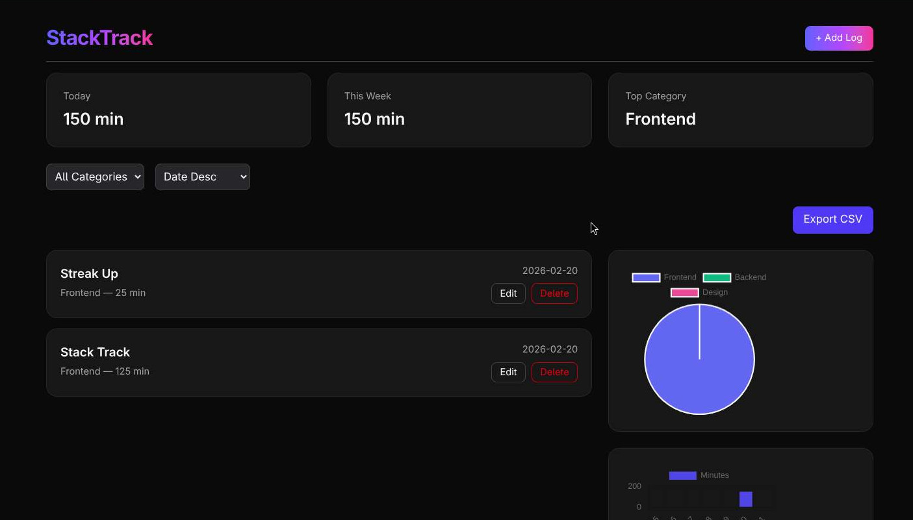
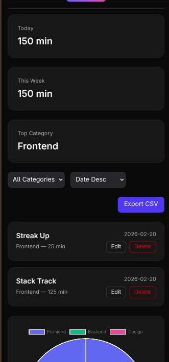

# StackTrack

**StackTrack** is a **frontend-only productivity web app** for tracking tasks and logging time spent per category. It helps users monitor daily activities, build streaks, and visualize productivity over time.

---

## Features

- Add, edit, and delete tasks with tracked minutes.
- Categorize tasks by default (Frontend, Backend, Design) or create custom categories.
- Persistent data using **browser localStorage**.
- Light and Dark theme support based on system preference.
- Responsive design for desktop, tablet, and mobile.
- Animated task cards with custom effects.
- Dashboard displaying tasks, categories, and summaries.

---

## Tech Stack

- **Framework:** React + TypeScript
- **Styling:** Tailwind CSS 4.1
- **Persistence:** Custom `useLocalStorage` hook
- **State Management:** React `useState` + props
- **Build Tool:** Vite + Bun

---

## Screenshots

